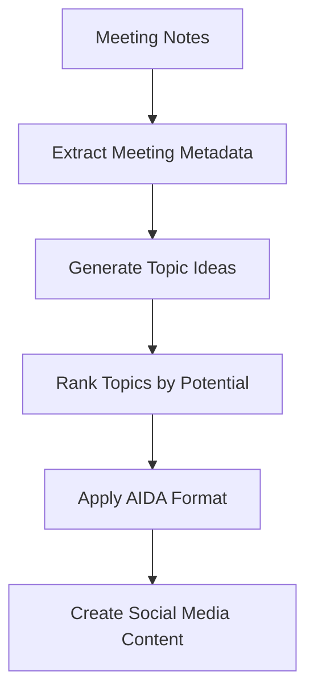

# Notegold: Meeting Notes to Content Flywheel

A modular system for transforming meeting notes into valuable content assets.

## Overview

Notegold implements a "Content as a Flywheel" approach that makes it easy to extract insights from client meetings and turn them into high-value content. The system processes meeting notes through a modular pipeline:



Each step in the pipeline transforms your meeting notes into progressively more refined content assets, from raw meeting notes to valuable, shareable content.

## Features

- 🔄 **Modular Pipeline**: Each processing step is modular and can be customized or replaced.
- 📊 **Value Ranking**: Uses the "Value Equation" to prioritize the most impactful content ideas.
- 🎯 **AIDA Framework**: Structures content using the Attention, Interest, Desire, Action framework.
- 📱 **Multi-Platform**: Creates variations for different social media platforms.
- 📝 **Extensible**: Add new processing nodes to expand the system.

## Installation

```bash
# Clone the repository
git clone https://github.com/cmagganas/notegold.git
cd notegold

# Set up the environment with uv (faster than standard venv)
make setup

# Configure your OpenAI API key (two options):
# Option 1: Set it in your environment
export OPENAI_API_KEY=your_api_key_here

# Option 2: Create a .env file (recommended)
echo "export OPENAI_API_KEY=your_api_key_here" > .env
source .env
```

## Usage

### Basic Usage

To process meeting notes:

```bash
# Process notes with automatic meeting ID generation
make process NOTES=path/to/meeting_notes.txt

# Process notes with a custom meeting ID
make process NOTES=path/to/meeting_notes.txt MEETING_ID=client_meeting_20250417
```

This will:

1. Create a directory structure in `meetings/[meeting_id]/`
2. Copy your meeting notes to the `notes/` subdirectory
3. Process the notes through the content flywheel pipeline
4. Generate various content artifacts and outputs

### Output Structure

All processed content will be available in:

```bash
meetings/[meeting_id]/
├── notes/      # Contains the original meeting notes
├── artifacts/  # Contains JSON data (metadata, topics, ranked topics)
├── outputs/    # Contains markdown files (AIDA content, social posts)
├── metadata/   # Contains processing metadata and summaries
└── logs/       # Contains detailed processing logs
```

### Key Output Files

The most valuable outputs are located in the `outputs/` directory:

- `aida_*.md` - Content structured in the AIDA format (Attention, Interest, Desire, Action)
- `social_posts_*.md` - Social media post variations for different platforms
- `content_summary.md` - Overview of all generated content with value scores

### Troubleshooting

If you encounter issues:

1. Ensure your OpenAI API key is properly set
2. Check that the meeting notes file exists and is readable
3. Look for error messages in the console output
4. Examine the logs in `meetings/[meeting_id]/logs/` for detailed errors

## Customizing the Processing Graph

You can create custom processing graphs by modifying the graph JSON structure. See `metadata/processing_graph.json` in any processed meeting directory for an example.

## Project Structure

```bash
notegold/                        # Root project directory
├── .venv/                       # Virtual environment (created by make setup)
├── .env                         # Environment variables (optional)
├── meetings/                    # All processed meetings
│   └── meeting_id123/           # Example meeting
│       ├── notes/               # Original meeting notes
│       ├── artifacts/           # JSON data files
│       ├── outputs/             # Content outputs (markdown)
│       ├── metadata/            # Processing metadata
│       └── logs/                # Processing logs
├── src/                         # Source code
│   ├── models/                  # Data models
│   │   └── data_models.py       # Pydantic models for data
│   ├── processors/              # Processing modules
│   │   ├── metadata_extractor.py # Extract metadata from notes
│   │   ├── topic_generator.py   # Generate topic ideas
│   │   ├── topic_ranker.py      # Rank topics by value
│   │   ├── aida_formatter.py    # Format using AIDA framework
│   │   └── content_generator.py # Generate social content
│   ├── utils/                   # Utility functions
│   │   ├── file_utils.py        # File and directory operations
│   │   ├── graph_utils.py       # Processing graph execution
│   │   ├── llm_utils.py         # LLM integration utilities
│   │   └── log_utils.py         # Logging utilities
│   └── main.py                  # Main entry point
├── pyproject.toml               # Project metadata and dependencies
├── Makefile                     # Build and operation commands
├── run.sh                       # Shell script for running app
└── README.md                    # Documentation
```

## Development

### Running Tests

```bash
make test
```

### Clean Build Artifacts

```bash
make clean
```

## License

MIT

## Easy Start

For first-time users, Notegold offers an interactive start mode:

```bash
# Run in interactive mode for guided setup
notegold start
```

This will prompt you for:

- Path to your meeting notes file
- Optional meeting ID
- Optional output directory

Follow the prompts to quickly process your meeting notes.
