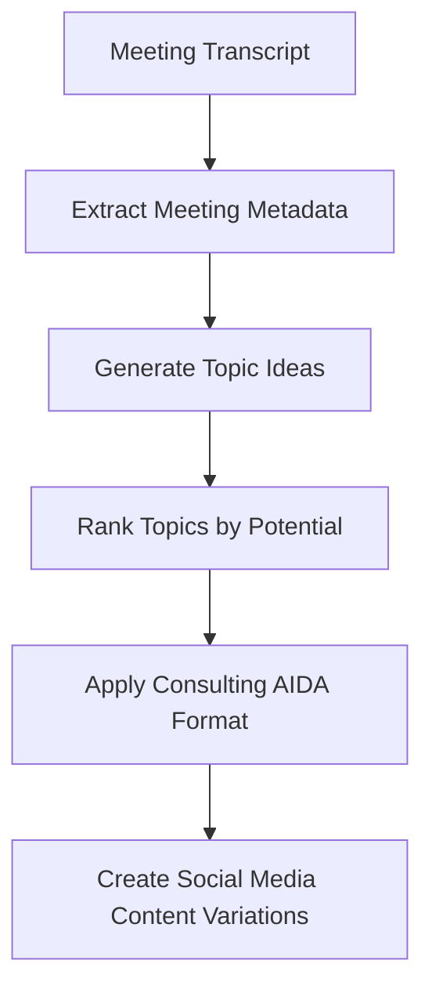

# Notegold: Meeting Notes to Content Flywheel

A modular system for transforming meeting transcripts into valuable content assets.

## Overview

Notegold implements a "Content as a Flywheel" approach that makes it easy to extract insights from client meetings and turn them into high-value content. The system follows a processing pipeline:



## Features

- 🔄 **Modular Pipeline**: Each processing step is modular and can be customized or replaced.
- 📊 **Value Ranking**: Uses the "Value Equation" to prioritize the most impactful content ideas.
- 🎯 **AIDA Framework**: Structures content using the Attention, Interest, Desire, Action framework.
- 📱 **Multi-Platform**: Creates variations for different social media platforms.
- 📝 **Extensible**: Add new processing nodes to expand the system.

## Installation

```bash
# Clone the repository
git clone https://github.com/cmagganas/notegold.git
cd notegold

# Set up the environment
make setup

# Set your OpenAI API key
export OPENAI_API_KEY=your_api_key_here
```

## Usage

### Basic Usage

```bash
./run.sh /path/to/meeting_notes.txt
```

Or with Make:

```bash
make process NOTES=/path/to/meeting_notes.txt
```

### Advanced Options

```bash
./run.sh /path/to/meeting_notes.txt --meeting-id custom_meeting_id --graph /path/to/custom_graph.json
```

## Customizing the Processing Graph

You can create custom processing graphs by modifying the graph JSON structure. See `metadata/processing_graph.json` in any processed meeting directory for an example.

## Project Structure

```
notegold/
├── meeting_id123/                # Created per meeting
│   ├── meeting_notes/            # Original transcript
│   ├── artifacts/                # Intermediate artifacts
│   ├── outputs/                  # Final content products
│   └── metadata/                 # Graph structure metadata
├── src/                          # Source code
│   ├── processors/               # Processing modules
│   ├── utils/                    # Utility functions
│   ├── models/                   # Data models
│   └── main.py                   # Main entry point
├── run.sh                        # Shell script runner
├── Makefile                      # Build and operation commands
└── README.md                     # Documentation
```

## Development

### Running Tests

```bash
make test
```

### Clean Build Artifacts

```bash
make clean
```

## License

MIT 